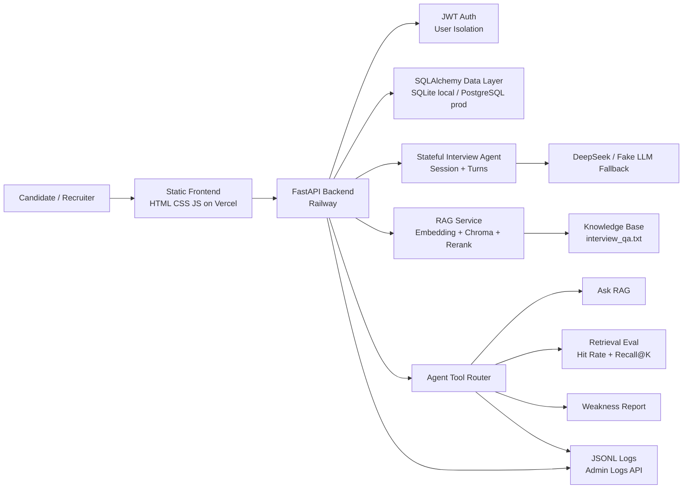
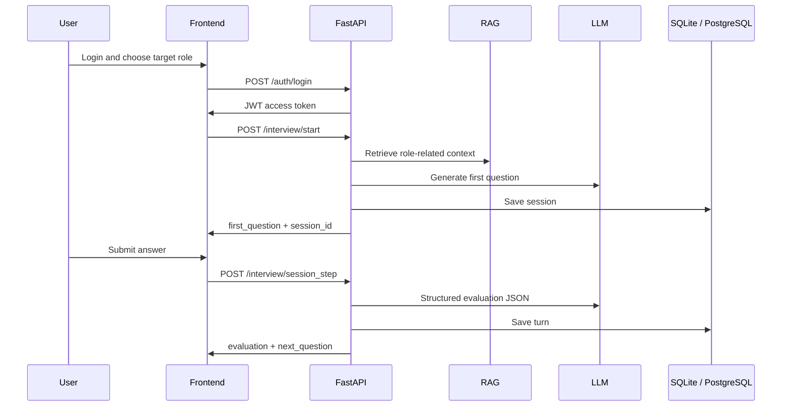

# Architecture

## System Overview

## Request Flow

## Why This Is More Than a Chatbot

- It has authenticated, user-scoped sessions.
- It stores interview state and historical turns.
- It measures retrieval quality instead of only claiming to use RAG.
- It includes a deterministic tool router that can be tested without model randomness.
- It has migrations, deployment, logging, tests, E2E coverage, and fallback behavior.
